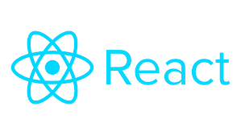

<h1 align="center">Bibliotecas e Frameworks</h1>
<h2 align="center"><strong>Bibliotcas</strong></h2>

Segundo o Wikipedia uma biblioteca é  uma coleção de subprogramas utilizados no desenvolvimento de software. Bibliotecas contém código e dados auxiliares, que provém serviços a programas independentes, o que permite o compartilhamento e a alteração de código e dados de forma modular.ou seja, uma biblioteca é uma parte do código que ira ser reutilizada para a implementaçao de outros códigos, utiliza –se bibliotecas para para não ser necessario reescrever codigos ja existentes.

 
 

<h2 align="center"><strong>Frameworks</strong></h2>

Existem varias definições para Framework, dentre elas  essa aqui: Gamma: "framework é um conjunto de classes cooperativas que compõem um design reutilizável para uma classe específica de software" ou seja,um Framework é uma abstração que une códigos comuns entre varios projetos de software. Em resumo um  framework pode ser um conjunto de bibliotecas ou componentes que são usados para criar uma base para uma aplicação.

 
<h2 align="center">Algumas das principais blibliotecas e frameworks atualmente utilizados em Javascript </h2>
 
<h2>REACT</h2>

