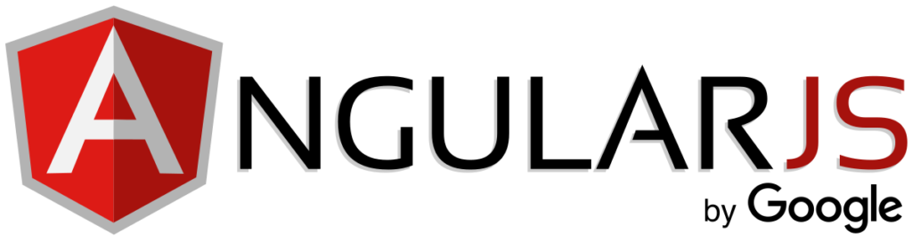

<h1 align="center">Bibliotecas e Frameworks</h1>
<h2 align="center"><strong>Bibliotcas</strong></h2>

Segundo o Wikipedia uma biblioteca é  uma coleção de subprogramas utilizados no desenvolvimento de software. Bibliotecas contém código e dados auxiliares, que provém serviços a programas independentes, o que permite o compartilhamento e a alteração de código e dados de forma modular.ou seja, uma biblioteca é uma parte do código que ira ser reutilizada para a implementaçao de outros códigos, utiliza –se bibliotecas para para não ser necessario reescrever codigos ja existentes.

 
 

<h2 align="center"><strong>Frameworks</strong></h2>

Existem varias definições para Framework, dentre elas  essa aqui: Gamma: "framework é um conjunto de classes cooperativas que compõem um design reutilizável para uma classe específica de software" ou seja,um Framework é uma abstração que une códigos comuns entre varios projetos de software. Em resumo um  framework pode ser um conjunto de bibliotecas ou componentes que são usados para criar uma base para uma aplicação.

 
<h2 align="center">Algumas das principais blibliotecas e frameworks atualmente utilizados em Javascript </h2>
 
<h2 align="center">REACT</h2>

O React surgiu em 2011, no Facebook e é definida como, “uma biblioteca JavaScript declarativa, eficiente e flexível para a criação de interfaces de usuário (UI)”. a biblioteca se transformou numa das principais do mundo no front-end. Ele usa componentes, que ajudam a encapsular código e estado. O uso de componentes facilita a construção de interfaces de usuário mais complexas. 

 
<h2 align="center">VUE.js</h2>

 

Vue JS é um framework JavaScript opensource, lançado em Fevereiro de 2014 por Evan You, Desenvolvedor que atuava em um dos projetos do Google Creative Labs, em 2014.Vue JS é muito utilizado para criar aplicações single page (página única) e também para desenvolver vários tipos de interfaces, que possuem necessidades de uma maior interação e uma melhor experiência para o usuário. 

 
<h2 align="center">AngularJS</h2>

Mantido pela Google e apoiado por uma enorme comunidade de desenvolvedores em todo o mundo, o AngularJS é um dos frameworks JavaScript mais importantes quando falamos de desenvolvimento web.Trata-se de um framework front-end opensource, baseado em JavaScript, para o desenvolvimento dinâmico de aplicações web. 

 
<h2 align="center">Node.js</h2>

Seu nascimento vem de 2009, durante uma conferência de JavaScript que ocorreu na Europa. Na época, o desenvolvedor Ryan Dahl mostrou seu experimento, que consistia em uma máquina virtual baseada no projeto JavaScript V8 da Google e que possuía um sistema de laço de eventos.   Node.js leva o JavaScript para o lado do servidor. (back-end). 

